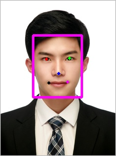

# [RetinaFace](https://github.com/heewinkim/retinaface)
 
 face detector with landmarks, RetinaFace PyPI implement
 
 reference : https://github.com/peteryuX/retinaface-tf2 
 


[](https://heewinkim-retinaface-streamlit-app-3nx0av.streamlitapp.com/)

<a href="https://www.buymeacoffee.com/heewinkim" target="_blank"></a>

----

### INSTALL
```sh
pip3 install refinaface
```

### USEAGE

```python

#pip3 install opencv-python
import cv2 
from retinaface import RetinaFace

# init with normal accuracy option
detector = RetinaFace(quality="normal")

# same with cv2.imread,cv2.cvtColor 
rgb_image = detector.read("data/hian.jpg")

faces = detector.predict(rgb_image)
# faces is list of face dictionary
# each face dictionary contains x1 y1 x2 y2 left_eye right_eye nose left_lip right_lip
# faces=[{"x1":20,"y1":32, ... }, ...]

result_img = detector.draw(rgb_image,faces)

# save ([...,::-1] : rgb -> bgr )
cv2.imwrite("data/result_img.jpg",result_img[...,::-1])

# show using cv2
# cv2.imshow("result",result_img[...,::-1])
# cv2.waitKey()
```

### result with drawing


